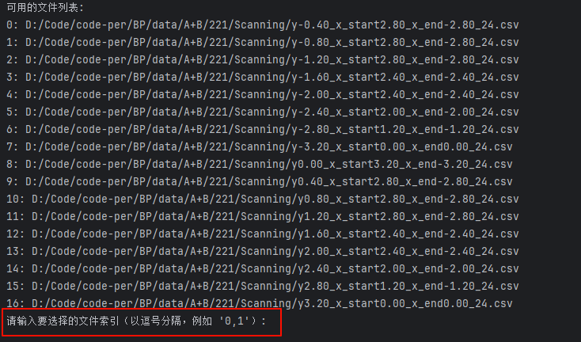
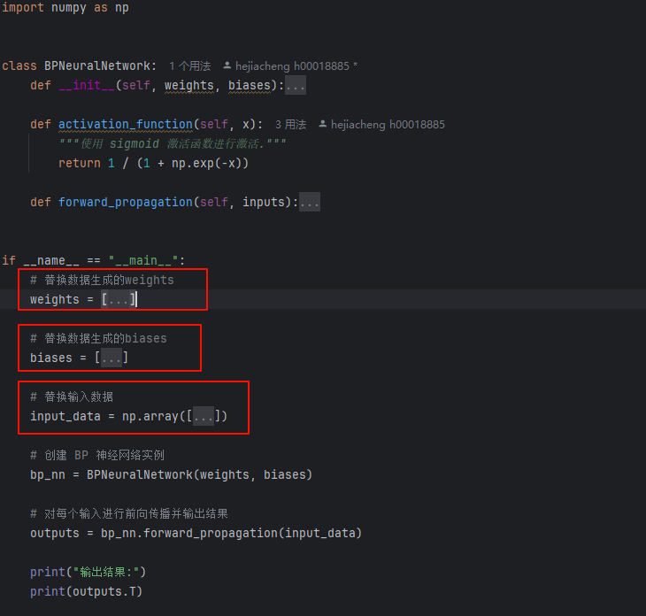

**BPNN全连接神经网络自动化**

**bpnn_config:** 文件为可配置的参数，根据需求进行修改。

- **data_dir:** 训练数据所在文件夹

* **select_files_or_not:** 如果需要手动选择训练哪些文件则为1，否则为0；如果为1，会出现下图输出8

+ **rowSkip:** 读取csv时是否需要跳过第一行header

- **selected_input_columns:** input数据在原始数据中的列数

* **selected_output_columns:** output数据在原始数据中的列数

+ **selected_input_columns_final:** input数据在getAllFfmData后的列数

- **selected_output_columns_final:** output数据在getAllFfmData后的列数

+ **input_size:** 输入层节点数

- **output_size:** 输出层节点数

* **hidden_layer:** 隐藏层层数

- **hidden_nodes:** 每层隐藏层节点数，数量需要和隐藏层层数对应

+ **activation_function:** 自定义每一层用到的激活函数，目前支持Sigmoid、Tanh、ReLU、Leaky_ReLU、ELU、SELU、Linear，这里的Linear就是y=x

- **criterion_type:** 自定义训练时索要使用的损失函数

* **optimizer_type:** 自定义训练时索要使用的优化器

+ **batch_size:** 总batch size

* **learning_rate:** 学习率，根据需求自定义大小

- **num_epochs:** 训练轮数，根据需求进行调整

+ **full_scale:** 全量范围（比如范围是-3.2至3.2的话全量范围是6.4）

- **test_size:** 选取多少百分比的数据作为test dataset

+ **random_state:** 随机种子

**forward_test.py:** 替换weights, biases, input_data三个参数可以对正向传播结果进行验证;
其中weights和biases为模型生成的weight_and_bias.json里的数据。
